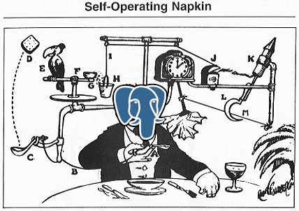

# The Rube Goldberg Database
## Introduction to Postgres functions and triggers

---


----

---
## Built-in Functions

----

```sql
> SELECT id, username, lower(username)
> FROM users;
```
| _id_ | _username_ | _lower_   |
|------|------------|-----------|
| 1    | LEFTshift  | leftshift |


----

```sql
> SELECT 2+2;
4

```

---

### `lower(text) → text`

```sql
> SELECT lower('GPN!');
gpn!
```

----

### `abs(numeric) → numeric`

```sql
> SELECT abs(-42);
42
```


----

Functions have __static types__.

---

What happens if we use a wrong type?

----

```sql
> SELECT lower(5);

ERROR:  function lower(integer) does not exist
LINE 1: SELECT lower(5);
               ^
HINT:  No function matches the given name and argument types.
       You might need to add explicit type casts.

```

----

Functions can be __overloaded__.

Postgres calls appropriate implementation.

----

### `round(numeric) -> numeric`

```sql
> SELECT round(1311.5);
1312
```

----

### `round(`*`v`*`  numeric, `*`s`*` integer) → numeric`

```sql
> SELECT round(3.141592, 2)
3.14
```

---

### `coalesce(value: T [, ...]) → T`

```sql
> SELECT name,
         coalesce(description, long_description, 'no description')
  FROM product;
```

----

Functions can be __variadic__.

---

### Similar but different:

Aggregate functions like `sum()`, `avg()`

---

## Your own functions!

* PL/pgSQL
* Python
* Perl
* ...

----

We'll stick to PL/pgSQL:
* available by default
* superset of SQL
* additional constructs like IF and loops


---

## Example: Recipes

----
#### `ice_cream_recipes`
| _name_: `text` | _ingredients_: `text[]`            |
|--------------  |--------------------------        |
| chocolate      | {milk, sugar, chocolate}         |
| nutella        | {milk, sugar, cocoa, hazelnut}   |


----

### Ugh, hazelnut

```sql
> SELECT *
  FROM ice_cream_recipes
  WHERE NOT 'hazelnut' = ANY(ingredients);
```

| _name_        | _ingredients_                    |
|-------------- |--------------------------        |
| chocolate     | {milk, sugar, chocolate}         |

----
#### `cake_recipes`
| _name_: `text`    | _ingredients_: `text`         |
|---------------    |------------------------------ |
| cheesecake        | flour, sugar, egg, margarine  |
| hazelnut cake     | egg, sugar, hazelnut          |


----
Need a different query :/

```sql
> SELECT *
  FROM cake_recipes
  WHERE ingredients NOT LIKE '%hazelnut%';
```

| _name_            | _ingredients_                 |
|---------------    |------------------------------ |
| cheesecake        | flour, sugar, egg, margarine  |


---

### Our first function
* Idea: Create function <br/> `contains(container, element) → boolean`
* Support different types of `container`s with overloads

----
#### Contains for `text`

```sql [1-8|1-2|3,7|4-6|1-8]
CREATE FUNCTION contains(container text, element text)
RETURNS boolean
AS $$
BEGIN
  RETURN container LIKE '%' || element || '%';
END;
$$
LANGUAGE plpgsql;
```

----
#### Contains for `text[]`
```sql [1-8|1,5|1-8]
CREATE FUNCTION contains(container text[], element text)
RETURNS boolean
AS $$
BEGIN
  RETURN element = ANY(container);
END;
$$
LANGUAGE plpgsql;
```

----
### New Query
```sql
> SELECT name, ingredients
> FROM cake_recipes
> WHERE NOT contains(ingredients, 'hazelnut');
```

Also works for `ice_cream_recipes`!
<!-- .element: class="fragment" -->

---
## Takeaways
* make queries more generic
* write complex logic once
* can reduce roundtrips
* much more powerful: insert/update/delete, SDL


----
## Downsides
* may do unexpected stuff
* pl/pgsql knowledge needed
* → documentation, good names!


---
## Triggers
* automatically call function upon operation
* intercept, modify values, …
* has access to values before and after update

----
### Changelog
Idea: Write all updates to changelog table

----
#### `article`
| _id_: `int` | _body_: `text` |
|-------------|----------------|
|             |                |

<br/>

#### `article_changelog`
| _id_: `int` | _time_: `timestamp` | _old_body_: `text` | _new_body_: `text` |
|-------------|---------------------|--------------------|--------------------|
|             |                     |                    |                    |

----

#### Changelog Function

```sql [1-11|1-2|5-8|1-11]
CREATE FUNCTION log_article_update()
RETURNS trigger
AS $$
BEGIN
  INSERT INTO article_changelog (id, time, old_body, new_body)
  VALUES (NEW.id, current_timestamp, OLD.body, NEW.body);

  RETURN NEW;
END;
$$
LANGUAGE plpgsql;
```

----

#### Changelog Trigger

```sql
CREATE TRIGGER log_update
AFTER UPDATE ON article
FOR EACH ROW
EXECUTE FUNCTION log_article_update();
```


----
#### `article` before update

| _id_: `int` | _body_: `text` |
|-------------|----------------|
| 42          | Hello GPN!     |


----
#### UPDATE

```sql
UPDATE article
SET body = 'Goodbye!'
WHERE id = 42;
```

----
| _id_: `int` | _body_: `text` |
|-------------|----------------|
| 42          | Goodbye!       |

<br/>

| _id_: `int` | _time_: `timestamp` | _old_body_: `text` | _new_body_: `text` |
|-------------|---------------------|--------------------|--------------------|
| 42          | 2022-05-20 21:24:31 | Hello GPN!         | Goodbye!           |

---
## Takeaways
* move functionality into database
* ensure complex consistency criteria
* ensure consistency across clients
* 'transactions for free'


----
## Downsides
* spooky
* harder to debug and test
* can negatively impact performance

---
## Closing thoughts
* with great power comes great Rube Goldberg potential
* consider other features first
    * (materialized) views
    * built-in functions
* can be super powerful and elegant!
